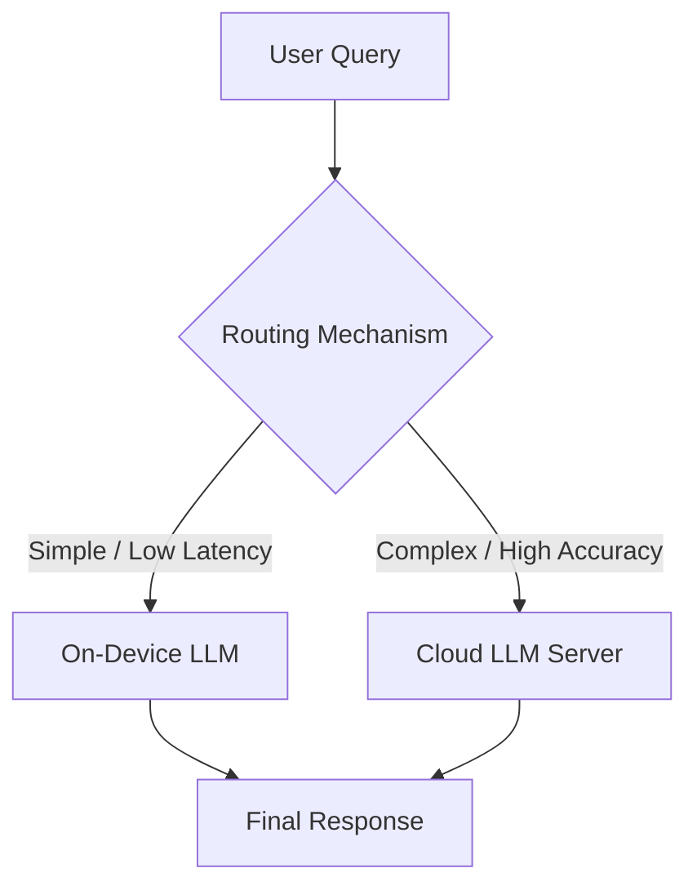

# Collaborative Inference

**Collaborative Inference** (also referred to as Device-Cloud Collaboration or Edge-Cloud Hybrid Inference) is an operational paradigm that distributes Large Language Model (LLM) processing workloads between resource-constrained edge devices (e.g., smartphones, local PCs) and high-capacity cloud servers. The objective is to combine the latency, cost, privacy, and offline capabilities of local on-device models with the superior reasoning performance of powerful cloud-based LLMs.

## Motivation & Core Trade-offs
Deploying LLMs entirely in the cloud or entirely on-device presents distinct disadvantages:
* **Cloud-Only paradigm**: Incurs substantial API costs, high server-side compute pressure, network latency, and privacy risks.
* **Device-Only paradigm**: Restricted by hardware limitations (GPU memory, battery life), local models (often 1B–8B parameters) lag significantly behind in reasoning accuracy for complex tasks.

Collaborative inference treats this as a dynamic optimization problem: route simpler queries to the on-device model and escalate complex queries to the cloud model under a cost/communication budget.

## Routing Architectures in Collaboration

An essential component of collaborative inference is the **router**, which decides where to dispatch the query. Two primary paradigms exist:

### 1. Decoupled External Routers (Two-Stage Pipeline)
An auxiliary classifier (e.g., a lightweight BERT or DeBERTa model) is trained on query text to predict whether the on-device model is sufficient or if cloud escalation is required.
* **Limitations**: Classifier routers struggle with "surface pattern blindness"—problems with identical syntactic structure can have vastly different reasoning difficulties. The classifier cannot easily assess the model's actual capability in real-time.

### 2. Intrinsic On-Device Routing
The routing decision is integrated directly into the on-device model's generation process (e.g., via reinforcement learning post-training like **[[gapg]]**).
* **Early Exit / Confidence Fallback**: The model starts solving the problem locally. If it detects that it is stuck or has low confidence, it outputs a special token (e.g., `<unknown> I need external assistance </unknown>`) to trigger cloud escalation.
* **Advantages**: Eliminates the overhead of a separate router model and uses the local model's actual reasoning progress to make the escalation decision.

## Key System Metrics & Constraints
Collaborative systems are typically evaluated on:
* **Cloud Offloading Ratio**: The proportion of queries sent to the cloud. Practical systems usually enforce a budget constraint (e.g., offloading at most 30% of total queries).
* **Performance Gap Recovered (PGR)**: The percentage of the performance difference between the standalone local model and the pure cloud model that the collaborative system recovers.
* **Resource Preservation**: The local compute and power saved by halting local generation early when a cloud call is inevitable.

## See Also
* [[fang-2025-device-cloud]] — The source paper on RL-based collaborative device-cloud inference.
* [[gapg]] — The reinforcement learning algorithm enabling intrinsic device-cloud routing.
* [[model-routing]] — The general practice of selecting models from a pool.
* [[llm-cascade]] — Sequential fallback and escalation mechanisms.
