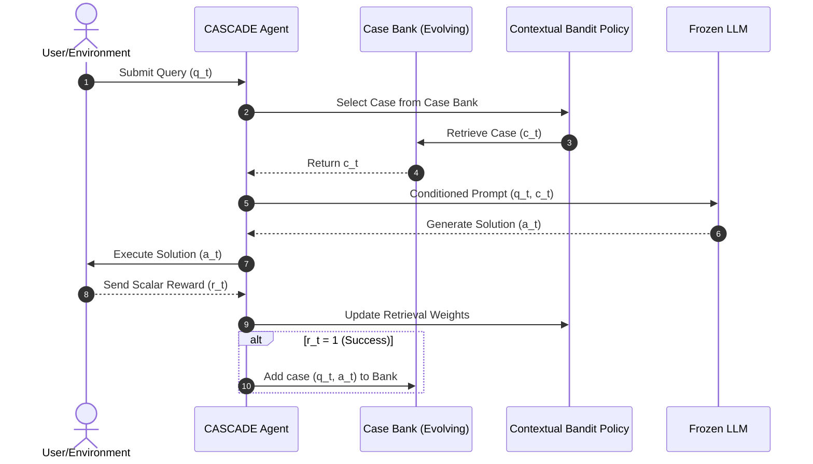

# CASCADE

**CASCADE** (CASe-based Continual Adaptation during DEployment) is a deployment-time learning framework designed to enable Large Language Model (LLM) agents to adapt and improve from interaction experience without modifying model parameters. By combining **Case-Based Reasoning (CBR)** with **Contextual Bandits**, CASCADE maintains and queries an evolving episodic memory (case bank) of successful past interactions to guide the fixed base LLM in solving new queries.

CASCADE was proposed by Siyuan Guo, Yali Du, Hechang Chen, Yi Chang, and Jun Wang in [[guo-2026-cascade]].

---

## Core Architecture

CASCADE structures the lifecycle of query execution and policy improvement into a 6-step online loop:

1. **Observe**: The agent receives a query $q_t$ at time $t$ from a continuous online stream.
2. **Retrieve**: The agent uses an adaptive contextual bandit policy ($\mu$) to select a relevant past case $c_t$ from the case bank $M_t$.
3. **Reuse & Revise**: The agent formats the query $q_t$ alongside the retrieved case $c_t$ (acting as an in-context exemplar or guideline) and passes it to the frozen LLM. The LLM generates a candidate solution $a_t \sim p_{\text{LLM}}(\cdot \mid q_t, c_t)$.
4. **Receive**: The agent deploys the solution and receives a binary feedback reward $r_t \in \{0, 1\}$ from the environment indicating success or failure.
5. **Update**: The agent updates the parameters of the contextual bandit retriever using the reward $r_t$ to improve future retrieval accuracy.
6. **Retain**: If the task was successful ($r_t = 1$), the pair $(q_t, a_t)$ is saved as a new case in the case bank ($M_{t+1}$). If the task failed ($r_t = 0$), the interaction is discarded to avoid polluting the episodic memory with incorrect examples.

---

## Contextual Bandit & Retrieval Policy

Unlike traditional Case-Based Reasoning frameworks that retrieve cases using fixed semantic similarity metrics (such as BM25 or cosine similarity on text embeddings), CASCADE models the retrieval task as a contextual bandit:
* **Context**: The embedding of the current query $q_t$.
* **Arms**: The set of cases currently in the case bank $M_t$.
* **Reward**: The success/failure outcome ($r_t$) of the LLM solution.

### Neural-LinLogUCB
CASCADE uses a hybrid contextual bandit algorithm, **Neural-LinLogUCB**, to estimate the likelihood of a case leading to a successful output. It leverages a neural network to extract low-dimensional features from the query context and applies a linear/logistic upper confidence bound (UCB) selection mechanism over those features. This allows the model to actively manage the **exploration-exploitation trade-off** by selecting cases that have high predicted utility while occasionally exploring cases with high uncertainty to improve the retriever's accuracy.

### Regret Separation
CASCADE's design decomposes the online regret $R_T$ into two manageable terms:
* **Coverage Gap**: The difference in performance between the absolute best possible action and the best case present in the current case bank. This is minimized by the **Retain** step, which continuously populates the memory with new cases to cover the query space.
* **Retrieval Regret**: The difference in performance between the best case in the case bank and the case selected by the retriever. This is minimized by the **Neural-LinLogUCB** bandit algorithm.

---

## Key Advantages

* **Parameter-Free LLM Adaptation**: Works natively with black-box commercial APIs (e.g., GPT-4, Claude) because it changes only the in-context prompt, not the model weights.
* **No-Regret Guarantee**: Formulating the case retrieval as a contextual bandit provides mathematical proofs of no-regret bounds over long-term interactions.
* **Extreme Compute Efficiency**: By avoiding gradient backpropagation, CASCADE bypasses the high training costs associated with fine-tuning (e.g., REINFORCE+LoRA) and online training.
* **Episodic Memory Interpretability**: Developers can inspect exactly which case was retrieved and why, making the agent's reasoning process fully transparent.

---

## See Also

* [[guo-2026-cascade]] — The original research paper.
* [[deployment-time-learning]] — The broader concept of adapting LLMs at deployment time.
* [[model-routing]] — Dynamic selection and distribution of LLM requests.
* [[llm-cascade]] — Sequential chaining of models (not to be confused with CASCADE).
