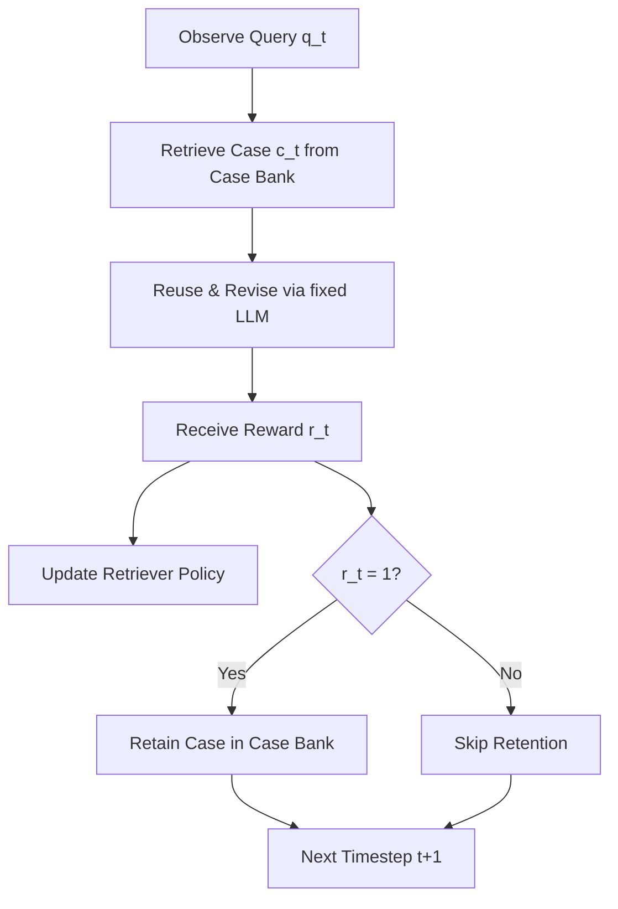

# CASCADE: Case-Based Continual Adaptation for Large Language Models During Deployment

[[guo-2026-cascade]] formalizes **[[deployment-time-learning]] (DTL)** as the third stage in the LLM lifecycle (following pre-training and fine-tuning). DTL enables LLM agents to continuously learn and adapt from interaction experience during deployment without updating the underlying model parameters (which remain fixed). 

To solve this, the authors introduce **[[cascade]]** (CASe-based Continual Adaptation during DEployment), a principled framework that equips LLM agents with an explicit, evolving episodic memory (case bank). By formulating experience retrieval as a contextual bandit problem, CASCADE optimizes the exploration-exploitation trade-off of which past experience to retrieve, providing the first DTL algorithm with provable no-regret guarantees. Across 16 diverse tasks (including medical diagnosis, legal analysis, code generation, web search, tool use, and embodied interaction), CASCADE improves the macro-averaged success rate by 20.9% over zero-shot prompting.

---

## Deployment-Time Learning (DTL) Formulation

The authors define DTL under three core operational constraints:
1. **Online Stream**: Queries $q_t$ are observed sequentially, requiring the agent to act online without looking ahead.
2. **Experience-Driven Feedback**: Learning is guided by scalar (specifically binary success/failure) feedback $r_t \in \{0, 1\}$ rather than gold labels.
3. **Fixed Parameters**: The base foundation LLM's parameters are fixed due to API accessibility or cost limitations. 

Instead of updating parameters, DTL adapts the **agentic components** (e.g., prompts, memory, tools, and retrieval policies) built around the fixed LLM. DTL is distinguished from:
* *Test-time adaptation* (e.g., Reflexion, TextGrad): Iterative optimization for a *single* query, which does not accumulate knowledge or generalize across different queries.
* *Static offline agent optimization* (e.g., DSPy, GEPA): Methods that optimize prompts/components on a training set before deployment but remain static once deployed.

---

## The CASCADE Framework

CASCADE implements Case-Based Reasoning (CBR) within DTL. Since the underlying LLM policy $p_{\text{LLM}}(\cdot \mid q_t, c_t)$ is stationary, the adaptation is controlled entirely by the retriever policy $\mu(\cdot \mid q_t, M_t)$ which decides which case $c_t$ from the case bank $M_t$ to retrieve.

The system executes a six-step online adaptation loop:
1. **Observe**: Receive the current query $q_t$.
2. **Retrieve**: Select a case $c_t \in M_t$ from the case bank using a contextual bandit retriever.
3. **Reuse & Revise**: Condition the fixed LLM on both $q_t$ and the retrieved case $c_t$ to generate the solution $a_t \sim p_{\text{LLM}}(\cdot \mid q_t, c_t)$.
4. **Receive**: Observe binary scalar reward $r_t \in \{0, 1\}$.
5. **Update**: Update the retriever policy $\mu$ using the reward signal.
6. **Retain**: If the interaction was successful ($r_t = 1$), retain the query-solution pair as a new case in $M_{t+1}$ ("only good cases are retained").

---

## Contextual Bandit & No-Regret Analysis

To manage the exploration-exploitation trade-off of case retrieval, CASCADE models each case in the case bank $M_t$ as an arm in a contextual bandit. It utilizes **Neural-LinLogUCB** to minimize retrieval regret.

### Regret Decomposition
The online learning regret $R_T$ over $T$ steps is decomposed into two distinct components:
$$R_T = \mathbb{E}\left[ \sum_{t=1}^T \left( R(q_t, a_t^*) - \bar{R}(q_t, c_t^*) \right) \right] + \mathbb{E}\left[ \sum_{t=1}^T \left( \bar{R}(q_t, c_t^*) - \bar{R}(q_t, c_t) \right) \right]$$

where:
* $a_t^*$ is the optimal solution for $q_t$.
* $c_t^*$ is the optimal case inside the current case bank $M_t$.
* $c_t$ is the case retrieved by the bandit policy.
* $R(q_t, a_t^*)$ is the maximum achievable reward for $q_t$.
* $\bar{R}(q_t, c)$ is the expected reward when using retrieved case $c$ for query $q_t$.

The decomposition separates the total regret into:
1. **Coverage Gap** (left term): The performance gap between the optimal solution and the best possible case in the current case bank. This is controlled and reduced over time by the **Retain** step, which expands the coverage of the query space.
2. **Retrieval Regret** (right term): The performance gap between the best case available in the case bank and the case actually retrieved. This is minimized by the **Neural-LinLogUCB** bandit algorithm.

---

## Empirical Results & Baselines

CASCADE was evaluated across 16 tasks (covering medical diagnosis, legal analysis, operational reasoning, code generation, embodied interaction, web search, and tabular reasoning on EHRs) using LLM sizes from 4B to 32B parameters.

### Comparison Baselines:
* **Zero-Shot Prompting**: Base performance without learning.
* **In-Context Reinforcement Learning (ICRL / ICRLPlus)**: Memory-based retrieval using static heuristic embeddings (e.g., BM25 or cosine similarity of sentence embeddings) without updating the retrieval policy based on rewards.
* **NP-CBR (Non-Parametric CBR)**: An ablation of CASCADE that retains successful cases but retrieves them based on raw semantic similarity rather than an adaptive bandit policy.
* **REINFORCE+LoRA**: A gradient-based on-policy RL baseline that updates the LLM parameters via parameter-efficient fine-tuning.

### Key Findings:
* **Online Improvement**: CASCADE demonstrates consistent online performance improvements, outperforming zero-shot prompting by an average of **20.9%** in macro success rate.
* **Retriever Adaptation**: CASCADE outperforms NP-CBR and ICRL, showing that dynamically adapting the retrieval policy via contextual bandits is crucial for avoiding irrelevant or misleading cases.
* **API Feasibility & Efficiency**: CASCADE achieves comparable or superior performance to gradient-based REINFORCE+LoRA, while avoiding the massive compute cost of backpropagation and being fully compatible with black-box API models.

---

## Where this fits
* [[cascade]] — The specific case-based deployment-time learning framework.
* [[deployment-time-learning]] — The concept of adapting agentic components during deployment.
* [[model-routing]] — Selecting and routing resources dynamically during inference.
* [[llm-cascade]] — Not to be confused with the CASCADE framework; sequential LLM cascade is a different paradigm.
