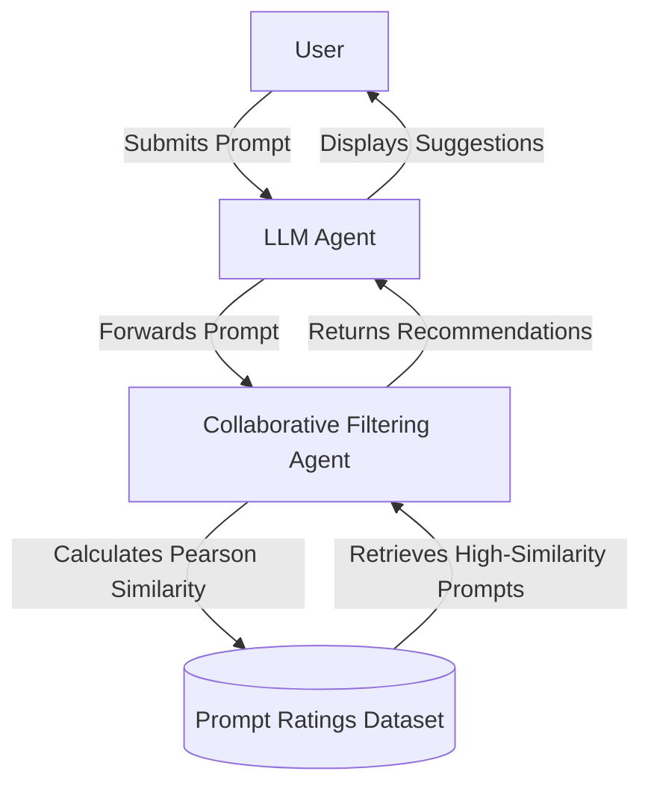

# Ethical AI prompt recommendations in large language models using collaborative filtering

## Summary
[[nelson-2025-ethical-rec]] proposes a framework that applies **[[collaborative-filtering]]** to Large Language Models (LLMs) to dynamically recommend ethical prompts to users. Designed to serve as a pre-emptive safety measure before the generation stage, the system leverages collective user interaction history to steer users toward prompts that align with ethical guidelines (fairness, accountability, bias mitigation) and discourages unethical prompt engineering. The authors construct a **two-agent prompt recommender system** and evaluate it using a new synthetic dataset of prompt-to-prompt ratings.

## Key Claims & Contributions
* **Collaborative Filtering for Prompts**: The paper is the first to propose utilizing collaborative filtering, commonly found in recommendation engines like MovieLens, for prompt selection and guidance in LLMs.
* **Pre-emptive Ethical Alignment**: Argues that traditional post-generation moderation (e.g., rule-based filtering or manual human review) struggles with scalability and fails to adapt to complex, evolving ethical dilemmas. Recommending ethical prompts guides user input *before* generation occurs.
* **Prompt-to-Prompt Dataset**: Introduces the first public synthetic prompt recommendation dataset, consisting of 3,612 user-prompt rating pairs.
* **Mitigating Code Generation Risks**: Highlights ChatGPT's vulnerabilities in code generation (such as SQL injections and hard-coded values), noting that ChatGPT-generated code was correct only 58% of the time in referenced studies, highlighting the need for structured prompt guidance to improve code quality.

## Methodology

### Two-Agent System Architecture
The proposed system splits the prompting and recommendation tasks between two distinct components:
1. **User-Facing LLM**: An LLM (e.g., ChatGPT) interacts with the user, taking inputs and outputting generated responses.
2. **Collaborative Filtering Agent**: A recommender backend containing a database of prompt ratings. The LLM forwards the user's current prompt to this agent, which computes prompt similarities and returns the most relevant ethical prompts as suggestions.

### Mathematical Formulation
To compute the similarity between a current prompt $a$ and another prompt $b$ in the dataset, the system uses the **Pearson correlation coefficient**:

$$\text{sim}(a, b) = \frac{\sum_{u \in U} (r_{u, a} - \bar{r}_a)(r_{u, b} - \bar{r}_b)}{\sqrt{\sum_{u \in U} (r_{u, a} - \bar{r}_a)^2} \sqrt{\sum_{u \in U} (r_{u, b} - \bar{r}_b)^2}}$$

Where:
* $U$ is the set of users who have rated both prompts.
* $r_{u, a}$ is the rating given by user $u$ to prompt $a$ (on a scale of 1 to 5).
* $\bar{r}_a$ is the average rating of prompt $a$.

The system then recommends the top- $k$ prompts with the highest similarity scores as follow-up options for the user.

### Synthetic Dataset
To validate the methodology, the authors created a dataset modeled after the MovieLens format (representing `Prompt, Prompt, Rating` instead of `User, Movie, Rating`):
* **Generation**: Created using **ChatGPT-4o**.
* **Scale**: 3,612 entries containing rating values from 1 to 5.
* **Availability**: Published on Kaggle at [prompt-recommendations-for-llm](https://www.kaggle.com/datasets/jordanln/prompt-recommendations-for-llm).

*Limitations*: The authors note that the synthetic nature of the dataset does not capture the full range of real-world user input and context-dependent ethical nuances, proposing that future work incorporate actual prompt datasets from high-stakes domains like healthcare and education.

## Where this fits
* **Concepts**:
  * [[collaborative-filtering]] — The core algorithmic paradigm applied to calculate similarities.
  * [[prompt-recommendation]] — Recommending prompts to guide users toward high-quality, safe outputs.
  * [[model-routing]] — Dynamically matching queries or prompts to optimize model interactions.
