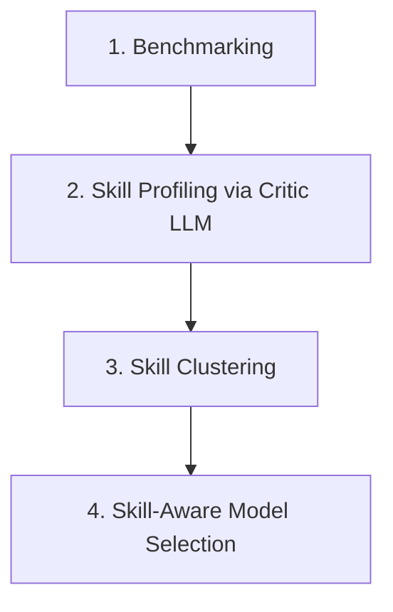

# Trust by Design: Skill Profiles for Transparent, Cost-Aware LLM Routing

## Overview
Okamoto et al. (Georgia Institute of Technology) introduce **BELLA** (Budget-Efficient LLM Selection via Automated skill-profiling) at the MLSys 2025 Young Professionals Symposium. The paper addresses a major limitation of current LLM routing and evaluation frameworks: the lack of transparency. Existing routers (e.g., [[frugalgpt]], [[routellm]]) operate as black boxes, making routing decisions based on aggregate performance metrics or opaque probability scores. 

BELLA resolves this by decomposing model evaluation and routing into granular, interpretable skills (e.g., numerical reasoning, temporal logic, data extraction). By utilizing a critic LLM to profile model behaviors on task instances and clustering these behaviors into capability matrices, BELLA enables practitioners to match task requirements with model profiles under explicit budget constraints while providing natural-language rationales for its decisions.

---

## Methodology
The BELLA framework operates in four distinct stages:

### 1. Benchmarking
Evaluates a candidate pool of LLMs on multi-skill reasoning tasks, collecting:
* **Performance metrics** (accuracy, F1 score, etc.).
* **Operational costs** (API fees, execution latency).
* **Model outputs** (including intermediate reasoning/CoT traces) to feed the critique pipeline.

### 2. Skill Profiling via Critic LLM
For each model-task-instance triplet, a strong critic LLM reviews the task input, reference ground truth, and model output. The critic extracts:
* **Demonstrated skills** (strengths): Capabilities successfully exhibited (e.g., correct value extraction, correct basic arithmetic).
* **Missing skills** (weaknesses): Abilities the model failed to demonstrate that led to errors (e.g., misunderstood keywords, wrong output format).
* **Skill criticality**: How important the presence or absence of that skill was to the overall task outcome.

Unlike traditional methods, this stage does not rely on a predefined skill ontology, allowing the critic to discover domain-specific skills adaptively.

### 3. Skill Clustering
To convert the unstructured natural-language skill descriptions from the critic into a unified capability taxonomy:
1. **Embedding**: Skill phrases are encoded into dense vectors using a sentence transformer model.
2. **Clustering**: A clustering algorithm (e.g., K-Means or hierarchical clustering) groups similar descriptions.
3. **Labeling**: Canonical, interpretable labels (e.g., `Data_Extraction`, `Numerical_Reasoning`, `Output_Formatting`) are assigned to clusters via majority voting or LLM summarization.
4. **Binarization**: Each task instance is re-encoded as a binary skill vector.

#### Capability Matrices
The clustering stage outputs three main representations:
* **Model Capability Matrix** $C \in [0, 1]^{M \times S}$: Entry $C_{m,s}$ represents model $m$'s proficiency at skill $s$, computed as the fraction of skill-requiring instances where the model successfully demonstrated that skill.
* **Task Requirement Matrix** $R \in \{0, 1\}^{T \times S}$: Entry $R_{t,s}$ indicates whether task $t$ requires skill $s$.
* **Cost Vector** $c \in \mathbb{R}^M$: Entry $c_m$ represents the operational cost (latency or monetary price) of model $m$.

### 4. Skill-Aware Model Selection
When a new task $t$ is submitted:
1. **Skill Inference**: A planner LLM identifies the required skills $r_t \in \{0, 1\}^S$ from task examples, or the user specifies them directly.
2. **Capability Filtering**: The candidate pool is filtered to capable models meeting proficiency thresholds:
   $$M_{\text{capable}} = \{m : C_{m,s} \geq \tau \text{ for all } s \text{ where } R_{t,s} = 1\}$$
3. **Cost-Constrained Selection**: Out of $M_{\text{capable}}$, the framework selects the model that maximizes estimated performance within the budget constraint $B$:
   $$\max_{m \in M_{\text{capable}}} \hat{p}(m, t) \quad \text{s.t.} \quad c_m \leq B$$
   where $\hat{p}(m, t)$ is estimated performance. The selector generates a natural-language rationale explaining which skills qualified the model, how it differs from alternatives, and how cost-performance trade-offs were resolved.

---

## Generalizability & Matrix Paradigms
The capability matrix structure provides a highly flexible foundation that supports multiple routing paradigms:
* **Similarity-based retrieval**: Computes cosine similarity or Euclidean distance between a task requirements vector $r_t$ and model capability profiles $c_m$ to rank alignment:
  $$\text{sim}(m, t) = \frac{c_m \cdot r_t}{\|c_m\| \|r_t\|}$$
* **Collaborative filtering**: Treats models as "users" and skills as "items," applying non-negative matrix factorization ($C \approx U V^\top$) to discover latent capability dimensions and predict performance on unseen skill combinations.
* **Supervised learning performance estimation**: Trains regressors or classifiers $f(r_t, c_m) \to \hat{p}(m, t)$ using features like inner products $\langle r_t, c_m \rangle$, concatenated vectors $[r_t; c_m]$, or element-wise products $r_t \odot c_m$.
* **Explainability through decomposition**: Provides clear explanations based on the margin of proficiency $\Delta C_{m,s} = C_{m,s} - \max_{m' \neq m} C_{m',s}$ on critical skills, enabling transparent comparison.

---

## Evaluation & Key Findings
* **Target Domain**: Demonstrates the framework on **financial reasoning** (a domain with high cost variance and diverse skill requirements, e.g., tabular extraction, temporal logic, numerical calculations) using data from the FLaME evaluation suite.
* **Qualitative vs. Quantitative Advantage**: Unlike other routers (such as [[routellm]] and [[frugalgpt]]) that maximize cost-efficiency purely as a black box, BELLA provides an auditable, skill-based decision trail.
* **Comparison with Prior Art**:
  * Unlike *FLASK* and *Skill-Slices* (which offer fine-grained skill evaluation but ignore cost and deployment optimization), BELLA bridges evaluation and production routing.
  * Unlike *EvalTree* (which is restricted to single-skill tasks), BELLA accommodates tasks requiring multiple simultaneous capabilities (multi-skill instances).

---

## Where this fits
* **Routing Paradigm**: Extends [[model-routing]] and [[dynamic-routing]] by adding a structured, interpretable capability layer rather than routing based on raw win probabilities or distance in embedding space.
* **Framework**: Serves as the basis for [[bella]], an interpretable, cost-aware LLM selector.
* **Contrast**: Contrasts with sequential confidence-based cascades (like [[frugalgpt]]), as BELLA selects the cost-optimal model prior to execution based on profiled capabilities.
* **Related evaluation**: Compares with granular evaluations such as *FLASK* and *EvalTree*, translating evaluation insights into operational routing decisions.
