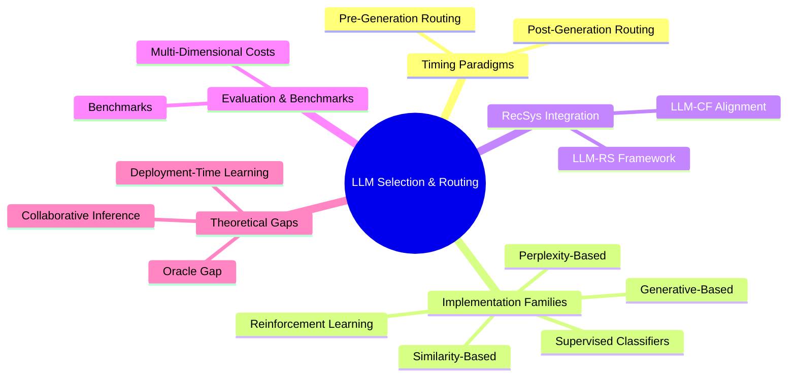

# Wiki Knowledge Mindmap

This synthesis page maps the core dimensions, implementation families, benchmarks, and theoretical challenges documented across this wiki's sources.

---

## 1. Timing Paradigms
This axis determines **when** routing decisions are made relative to output generation:
* **[[pre-generation-routing]]**: The router evaluates query/context features first, selecting a target model *before* any generation.
  * **Core Benefit**: Minimizes latency (invokes exactly one model).
  * **Instantiations**: intent classifiers, semantic similarity matching, and [[query-complexity-routing]] (routing based on chitchat vs. extraction vs. reasoning).
* **[[post-generation-routing]]**: A cheaper model attempts generation first; a stop-judger checks response quality (e.g., via token log-probs or code execution) to decide whether to accept or escalate.
  * **Core Benefit**: Evaluative rather than predictive—routing is based on actual output quality.
  * **Instantiations**: [[llm-cascade]] pipelines (championed by [[frugalgpt]]) and multi-choice cascading.

## 2. Implementation Families
This axis determines **how** the routing function is implemented:
* **[[similarity-based-routing]]**: Leverages unsupervised semantic distance.
  * **Methods**: [[knn-routing]] (Li 2025), clustering queries via k-means to generalise to dynamic model pools without retraining ([[uniroute]]), and preference-similarity (e.g., [[routellm]]).
* **Supervised Classifiers**: Uses labeled training data to predict model suitability.
  * **Methods**: Matrix Factorization encoder-decoders mapping queries/models into a joint latent space ([[embedllm]]), and Item Response Theory models measuring item difficulty vs. model ability ([[irtnet]]).
* **[[rl-based-routing]]**: Learns routing policies dynamically from environment feedback.
  * **Methods**: Contextual bandits (Greedy LinUCB for sequential routing under context evolution in [[poon-2026-contextual-bandits]]) and policy-gradient algorithms (GRPO/PPO for reasoners).
* **[[generative-routing]]**: Relies on internal states/outputs of LLMs themselves.
  * **Methods**: First-token log-probabilities, prompting a meta-LLM to pick a model, or code execution pass/fail checks in cascades.
* **[[perplexity-based-routing]]**: Uses intrinsic language modeling signals.
  * **Methods**: Standard Perplexity (PPL), Pseudo-Perplexity (PPPL), and Koya Pseudo-Perplexity (KPPPL in [[koya]]) as zero-shot, training-free indicators of language/task compatibility.

## 3. RecSys Integration
The bidirectional relationship between recommender systems (RS) and LLMs:
* **[[llm-rs-framework]]**: Prompting and pipeline designs for recommendation (Xu 2024). Establishes that two-stage retrieve-then-rerank structures mirror LLM cascades.
* **[[llm-cf-alignment]]**: Projects traditional Collaborative Filtering (CF) latent vectors directly into the LLM's token space via frozen alignment adapters ([[a-llmrec]]). Solves the "warm-scenario gap" by introducing collaborative signals to the LLM.

## 4. Evaluation & Benchmarks
How routing capability and efficiency are measured:
* **Benchmarks**: Standardizing routing benchmarks across query difficulty levels (easy/medium/hard in [[routereval]]), large-scale unified frameworks ([[llmrouterbench]]), and multimodal text+image routing ([[mmr-bench]]).
* **Multi-Dimensional Costs**: Moving beyond API token pricing to optimize system latency, compute resource footprints, and environmental impact (kWh energy, carbon emissions).

## 5. Theoretical & Operational Gaps
The next-generation challenges in the field:
* **[[oracle-gap]]**: The persistent performance gap between real routers and the theoretical maximum (oracle). Driven by model-recall failures (misidentifying when a cheaper model could succeed) and diminishing returns in large model pools.
* **[[deployment-time-learning]]**: The "third lifecycle stage" where routing policies dynamically adapt to query shifts and new models during deployment without retraining the underlying LLMs.
* **[[collaborative-inference]]**: Distributing inference workloads across heterogeneous resources (such as reinforcement-learned device-cloud collaborations in [[fang-2025-device-cloud]]).
